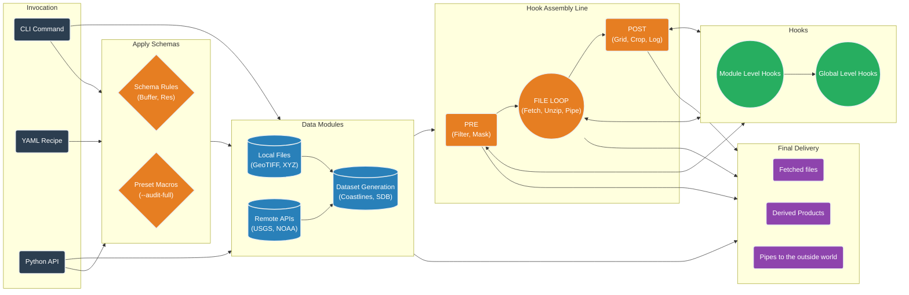

# 🌍 Fetchez 🐄

**Fetch geospatial data with ease.**

*Fetchez Les Données*

[](https://github.com/continuous-dems/fetchez)
[](LICENSE)
[](https://www.python.org/)
[](https://badge.fury.io/py/fetchez)
[](https://cudem.zulip.org)

**Fetchez** is a lightweight, modular and highly extendable Python library and command-line tool designed to discover and retrieve geospatial data from a wide variety of public repositories. Originally part of the [CUDEM](https://github.com/continuous-dems/cudem) project, Fetchez is now a standalone tool capable of retrieving Bathymetry, Topography, Imagery, and Oceanographic data (and more!) from sources like NOAA, USGS, NASA, and the European Space Agency.

---



---

### ❓ Why Fetchez?

Geospatial data access is fragmented. You often need one script to scrape a website for tide stations, another to download LiDAR from an S3 bucket, and a third to parse a local directory of shapefiles.

**Fetchez unifies this chaos.**
* **One Command to Fetch Them All:** The syntax is always the same: `fetchez [module] -R [region]`.
* **Streaming First:** Fetchez prefers streaming data through standard pipes over downloading massive archives to disk.
* **Infrastructure as Code:** Define complex data pipelines, cropping, and gridding workflows using CLI switches or simple YAML "Recipes".

## 🌎 Features

* One command to fetch data from [50+ different modules](https://fetchez.readthedocs.io/en/latest/modules/index.html), (SRTM, GMRT, NOAA NOS, USGS 3DEP, Copernicus, etc.).
* Built-in download management handles retries, resume-on-failure, authentication, and mirror switching automatically.
* Seamlessly mix disparate data types (e.g., fetch Stream Gauges (JSON), DEMs (GeoTIFF), and Coastlines (Shapefile) in one command).
* Define automated workflows (Hooks) (e.g., download -> unzip -> reproject -> grid) using Python-based Processing Hooks.
* Save complex processing chains (Presets) as simple reusable flags (e.g., fetchez ... --run-through-waffles).
* Supports user-defined Data Modules *and* Processing Hooks via `~/.fetchez/`.

---

## 📦 Installation

```bash
pip install fetchez
```

## 🚀 Quickstart
Fetch Copernicus topography and NOAA multibeam bathymetry for a specific bounding box in one command:

```bash
fetchez -R loc:"Miami, FL" copernicus multibeam --audit-log miami_audit.json
```

Or run a full processing pipeline from a YAML recipe:

```bash
fetchez recipes/my_dem_project.yaml
```

---

## 📚 Documentation
Ready to do more? Check out our [Official Documentation](https://fetchez.readthedocs.io) to learn about:

* **The Python API:** Build custom fetchers into your apps.

* **Recipes & YAML:** Run custom workflows from a simple YAML configuration.

* **Hooks & Presets:** Automate unzipping, filtering, and processing.

* **Domain Schemas:** Enforce rigorous geospatial standards automatically.

* **Custom Plugins:** Write your own data fetchers.

---

## ⚖ License

This project is licensed under the MIT License - see the [LICENSE](https://github.com/continuous-dems/fetchez/blob/main/LICENSE) file for details.

Copyright (c) 2010-2026 Regents of the University of Colorado
